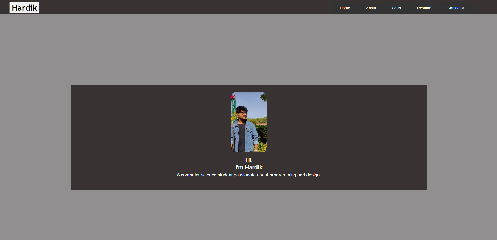

# MY-PORTFOLIO

# My Portfolio Website

## Table of Contents

- [Description](#description)
- [Sections](#sections)
- [Demo](#demo)
- [Installation](#installation)
- [Usage](#usage)
- [Technologies Used](#technologies-used)
- [Contributing](#contributing)
- [License](#license)
- [Contact](#contact)

## Description

This repository contains the source code for my personal portfolio website. It features sections for About Me, Home, Skills, Contact Us, and Resume.

## Sections

- **Home**: Provides an introduction and overview of my skills and experiences.
- **About Me**: Offers a detailed description of who I am, my background, and my interests.
- **Skills**: Highlights the technical and soft skills I possess relevant to my field.
- **Resume**: Provides a downloadable PDF version of my resume.
- **Contact Us**: Allows visitors to get in touch with me easily through a contact form.

## Demo

- You can view a live demo of the portfolio at [Link to Live Demo](https://hardik0o0.free.nf/).

- 

## Installation

- To run this project locally, follow these steps:

- 1. Clone the repository to your local machine using the following command
- 2. git clone https://github.com/xHARDIKx/my-portfolio.git
- 3. Open the project folder in your preferred code editor.

- Open index.html in your web browser.

# Usage

- Customize the portfolio website to make it your own:

- Replace the placeholder content in each section with your own information.
- Add your projects and experiences in the relevant sections.
- Customize the styling in styles.css to match your personal brand.
- Technologies Used
- HTML
- CSS
- JavaScript
- [Library/Framework, e.g., Bootstrap, React, etc.]
- Contributing
- If you'd like to contribute to this project, please follow these steps:

- Fork the repository.
- Create a new branch for your feature or bug fix.
- Make your changes and commit them.
- Push to your fork and submit a pull request.

# License
- This project is licensed under the MIT License.

# Contact

- For inquiries or feedback, please contact me at your-email@example.com.

- Note: This README is just a template. You should customize it to suit your specific project.

- Disclaimer: The portfolio content and images used in this project are for demonstration purposes only. Please replace them with your own content to avoid any copyright issues.

# About Me Section
- In the "About Me" section, provide a detailed description of yourself, your background, and your interests. You can also include any personal achievements or goals you'd like to share.

# Skills Section
- In the "Skills" section, highlight the technical and soft skills that you possess. This can include programming languages, tools, frameworks, and any other relevant skills.

# Contact Us Section
- The "Contact Us" section allows visitors to get in touch with you easily. A contact form is provided for users to send messages directly to your email address.

# Resume Section
- The "Resume" section provides a downloadable PDF version of your resume. Make sure to update this with your latest resume.

# Technologies Used
- List the technologies, languages, libraries, and frameworks used in your project. This helps others understand the tech stack you used.

# Contributing
- If you'd like to contribute to this project, we'd be happy to have your help! Follow these steps:

- Fork the repository.
- Create a new branch for your feature or bug fix.
- Make your changes and commit them.
- Push to your fork and submit a pull request.
- License
- This project is licensed under the MIT License. See the LICENSE file for details.

# Contact
- For inquiries or feedback, please contact me at your -Hardik21673@gmail.com.

- Thank you for visiting my portfolio!

- Author: Hardik

- Website: https://hardik0o0.free.nf/

- LinkedIn: https://www.linkedin.com/in/hardik0o0/

- GitHub: xHARDIKx

